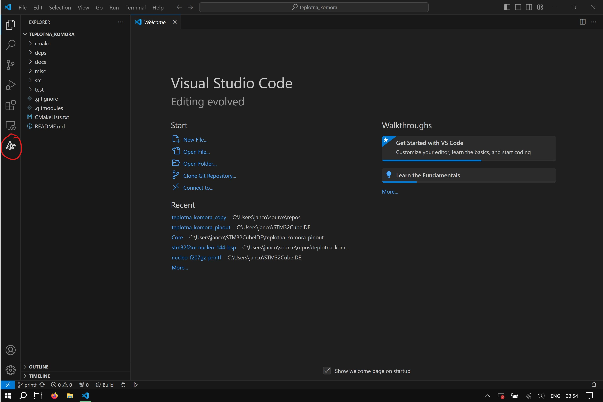
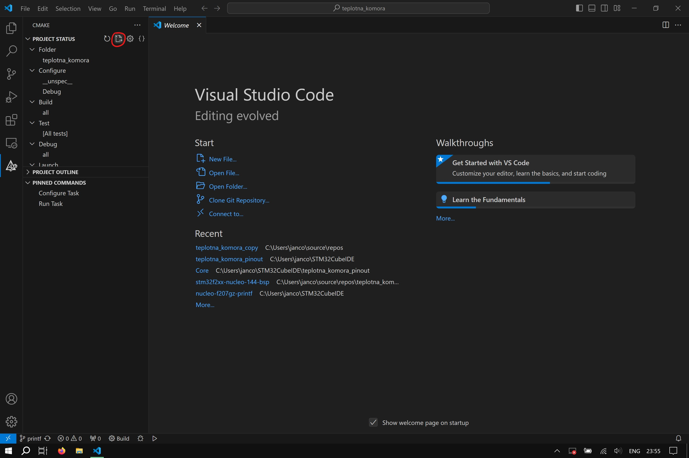
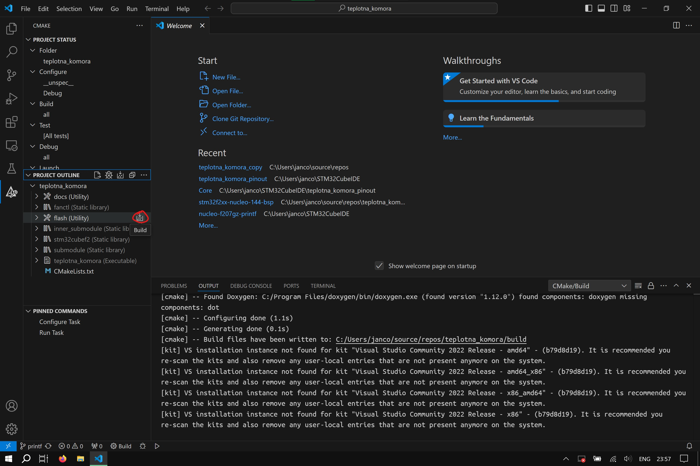

# Teplotná komora - Tímový projekt

Intro

## Quickstart

### Prerequisites

- **cmake** >= v3.22.0
- **ninja** >= v1.11.0
- **gcc-arm-none-eabi** >= v12.3.0
- **doxygen** >= 1.12.0 (optional for docs generation)
- **PuTTY, minicom** or similar program to read serial COM port
- **STM32CubeProg** >= v2.17.0 used for flashing FW
- **STM32CubeIDE** (optional Eclipse based IDE used for programming and debugging STM32 projects)
- **STM32CubeMX** (optional auto project generator)

#### Installation Windows

You can use the `winget` pkg manager to get the previously mentioned prerequisites via command:
```
winget install Kitware.CMake Ninja-build.Ninja Arm.GnuArmEmbeddedToolchain DimitriVanHeesch.Doxygen PuTTY.PuTTY
```

Make sure to restart the PowerShell session after installation or add additional missing installation directories to your `$env:PATH` or run the PowerShell script under `misc\env.ps1` that adds `gcc-arm-none-eabi` and `STM32CubeProg` installed in default locations temporarily to your `$env:PATH` until you close the current PowerShell session.

#### Installation Ubuntu

```
# apt install cmake ninja gcc-arm-none-eabi doxygen minicom
```

#### STM32Cube Installation

If you plan on using `STM32CubeIDE` `STM32CubeProg` and  `gcc-arm-none-eabi` comes bundled with it.

Go ahead and create a [myST](https://my.st.com) account, the stupid ST webiste won't let you download any STM32Cube Development Tools without it.

You can get them under following links:
- [STM32CubeIDE](https://www.st.com/en/development-tools/stm32cubeide.html#st-get-software)
- [STM32CubeMX](https://www.st.com/en/development-tools/stm32cubemx.html#st-get-software)
- [STM32CubeProg](https://www.st.com/en/development-tools/stm32cubeprog.html#st-get-software)

### Usage

#### Configure

Configure the project by issuing following command:
```
cmake -S . -B build -G Ninja
```

#### Compile

Compile the project by issuing following command:
```
cmake --build build -j [num of CPU threads]
```

#### Flash

To flash the firmware first connect the STLink via USB to your PC and issue command:
```
cmake --build build --target flash
```

#### Read COM Windows

Press `Win + R` key combination and run: `devmgmt.msc`. Under section `Ports (COM and LPT)` look for `Silicon Labs (COM6)`. Launch `PuTTY` and select the `Serial` radio button for `Connection type`, enter `COM6` for `Serial line` and `115200` for `Speed`.

#### Read COM Ubuntu

List available serial ports:
```
$ ls /dev/ttyACM*
```

Launch minicom and listen to `/dev/ttyACM0`:
```
$ minicom -D /dev/ttyACM0
```

#### Build docs

```
cmake --build build --target docs
```

### Using VSCode

Recommended extensions:

- **C/C++**
- **C/C++ Extension Pack**
- **C/C++ Themes**
- **CMake**
- **CMake Tools**

Install them by issuing following commands:
```
code --install-extension ms-vscode.cpptools
code --install-extension ms-vscode.cpptools-extension-pack
code --install-extension ms-vscode.cpptools-themes
code --install-extension twxs.cmake
code --install-extension ms-vscode.cmake-tools
```

Enable these extensions and restart VSCode.

#### Configure





#### Compile


#### Flash



## Rules

### General guidelines

- This project uses C++20 with an option to upgrade to C++23 if necessary.
- Use `.cpp` suffix for source files and `.hpp` for header files.
- Use `#pragma once` for header guards instead of a pair of `#ifndef FOO_H \n #define FOO_H` at the top and `#endif` at the bottom of a header file.
- Create your individual CMake subdirectories in `src/` see example in `src/fanctl`.
- Document function and object declarations with example in `src/app.hpp` for doxygen docs generation.
- Guard your created CMake subdirectories source and header files within `namespace` keyword with the same name as the name of the created subdirectory.
- Keep the same structure of the subdirectories as in example subdirectories.
- Place public header files into `src/[name_of_subdiretory]/include/[name_of_subdiretory]/`.
- Keep private header files in `src/[name_of_subdiretory]` just like in `src/submodule`.
- Create test functions inside `src/[name_of_subdiretory]/include/[name_of_subdiretory]/test.hpp` ready to test your newly created functionality.
- Modularize your code as much as possible into individual subdirectories.
- Avoid creating circular dependencies within your subdirectories.
- If you need more abstraction you're allowed to use OOP.
- Use `class` keyword for objects containing member methods, use `struct` keyword for objects with member variables only. If you want to add methods to it rewrite it with `class` keyword.
- Use simple control flow. Avoid deeply nested code. Rewrite the algorithm or consider using a state machine.
- Avoid functions that are too long. Consider splitting them into multiple functions.
- Use `const` as much as possible in place of variables, object member declarations and function arguments. Try to create algorithms without creating side effects when possible.
- Avoid using C style raw pointers, use C++ references instead when possible.
- Pass arguments as `const` reference to avoid unnecessary copying.
- Use `unsigned` version of numerical data types to avoid overflow into negative values when needed.
- Use `constexpr` whenever computation of an expression at the compile time is possible.
- Avoid global variables.
- If you want to return mulitple parameters from a function return a `struct` or use `std::tuple`.
- Use C++ for range loops to iterate over iterable objects or use iterators.
- Use `#include <cstdint>` and `uint8_t` or `uint16_t` data types to express the size of a variable instead of `unsigned char` or `unsigned short`.
- Use `nullptr` keyword instead of `NULL` macro.
- Avoid using `static` keyword when declaring local variables.
- For beginners following line:
```
    const std::array<uint8_t, 4> data = { 0, 1, 2, 3 };
```
copy initializes the array, meaning it invokes the default aggregate initialization constructor and then invokes the copy constructor. Use the following line to avoid unecessary copying:
```
    const std::array<uint8_t, 4> data { 0, 1, 2, 3 };
```

### Banned language features

- C++ exceptions
- Operator overloading
- Heap allocations (meaning avoid using `std::string`, `std::vector`, `new` and `delete` keyword, `calloc`, `malloc` and `free` functions etc.) instead allocate on the stack and use RAII.
- Raw C style square bracket arrays, use `std::array` instead. When interfacing with C APIs using pointers use `T* std::array<T, U>::data()` to extract the raw pointer from the `std::array` `class` for example.
- Raw C style `const char*` strings use `std::string_view` instead.
- C style `union` objects, please use `std::variant` instead.
- Anonymous C style enumerations using the `enum` keyword, please use `enum class` instead. Use `static_cast<T>` when conversion is needed.